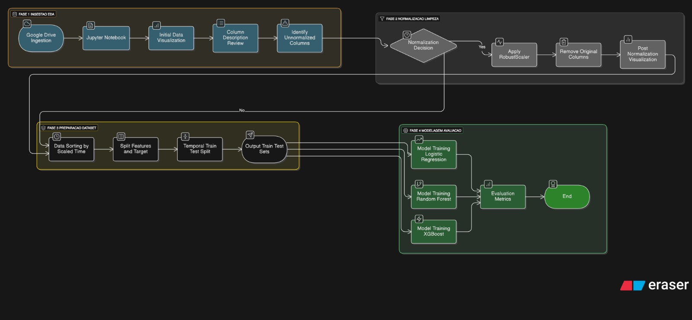
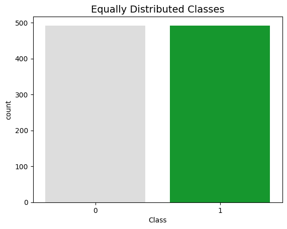
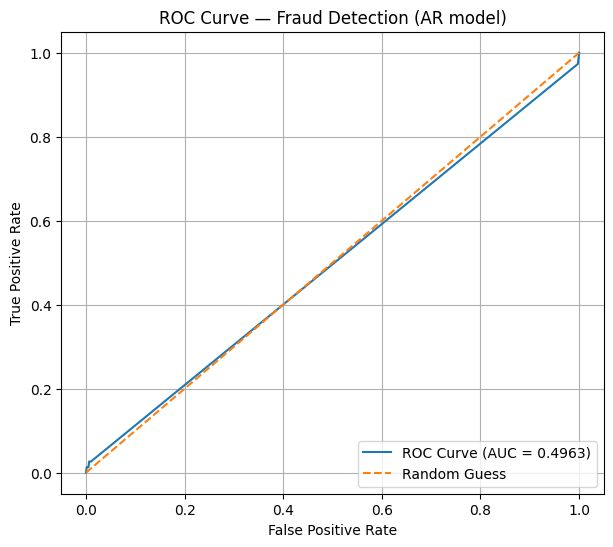
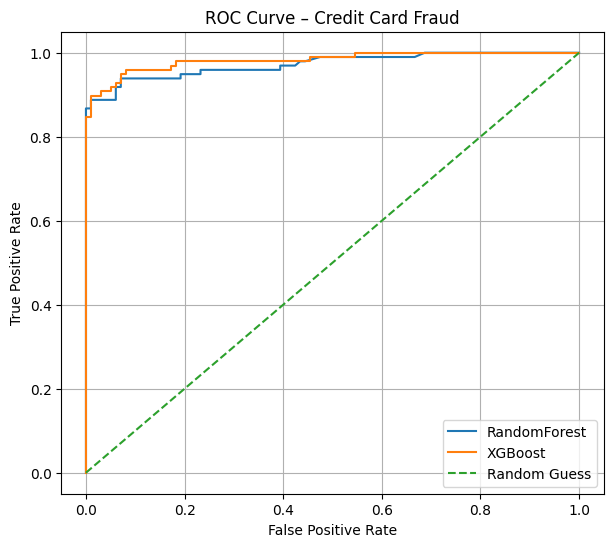
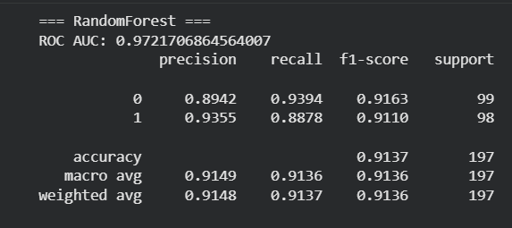
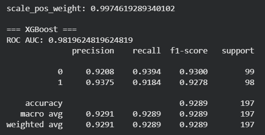

# Cesar School | Big Data Foundation

## Projeto em Fundamentos de Big Data  
### Detecção de Transações Fraudulentas com Cartão de Crédito  

## Introdução

O presente projeto tem como tema central a Detecção de Fraudes em Transações de Cartão de Crédito, utilizando um dataset real de operações feitas por clientes europeus em setembro de 2013. O objetivo principal é desenvolver um pipeline de dados robusto capaz de identificar automaticamente transações suspeitas de fraude.

O dataset apresenta desafios críticos:

* Anonimato dos Dados: As variáveis principais (V1 a V28) foram transformadas pela Análise de Componentes Principais (PCA), o que obscurece o significado específico das features.

* Desbalanceamento Extremo: A classe de interesse (fraude) é a minoritária, representando menos de 0.2% do total das transações (492 fraudes em mais de 284 mil transações normais).

## Motivação

A relevância do projeto reside na simulação de um problema típico de Big Data e sua aplicação prática no setor financeiro.

### O Desafio em Contexto de Big Data
Mesmo sendo uma amostra de apenas dois dias, o dataset reflete a complexidade de um sistema real, onde:

* Milhares de transações acontecem a cada segundo e precisam ser analisadas em tempo real para evitar fraudes.

* O desafio é o volume de informações, a velocidade com que os dados chegam e a complexidade das variáveis que precisam ser processadas.

* É um caso onde a quantidade de dados legítimos é enorme comparada às poucas fraudes.

## Objetivo do Projeto 
O principal objetivo deste projeto é construir um modelo de machine learning capaz de detectar com precisão transações fraudulentas (Classe 1) em um dataset de cartões de crédito, superando o desafio do extremo desequilíbrio de classes (onde as fraudes são eventos raros, representando apenas 0.17% das transações).

O projeto busca alcançar isso através das seguintes etapas-chave:

* Pré-processamento de Dados: Padronização de features (como 'Time' e 'Amount') usando o RobustScaler.

* Tratamento de Desequilíbrio: Utilização de técnicas como subamostragem (undersampling) e pesos de classe balanceados (class_weight='balanced') para permitir que os modelos aprendam efetivamente com a minoria de casos de fraude.

* Análise de Features e Visualização: Uso de técnicas de redução de dimensionalidade (t-SNE, PCA, Truncated SVD) para visualizar a separabilidade das classes no espaço de features.

* Modelagem e Otimização: Avaliação e implementação de modelos de classificação (como Regressão Logística, Random Forest e XGBoost) focados em métricas de desempenho que priorizem a detecção da classe minoritária (como ROC AUC e Recall).

---

## Pipeline de Dados  

O pipeline foi implementado em **ambiente simulado (Google Colab + Google Drive)**,  
seguindo as três etapas principais de um fluxo de Big Data:

| Etapa | Descrição | Ferramentas | Camada |
|-------|------------|-------------|--------|
| **Ingestão & Validação** | Leitura completa do dataset `creditcard.csv` (Kaggle) e verificação de consistência (shape, info, nulos, classes). | Python + Pandas | BRONZE |
| **Armazenamento** | Organização dos arquivos em diretórios no Google Drive (`/BigData/dados/`). | Google Drive | BRONZE |
| **Transformação** | Normalização das colunas Time e Amount com RobustScaler (melhor para dados com outliers).| Scikit-learn | SILVER |
| **Limpeza de Features** | Remoção das colunas originais (Time, Amount) após o scaling e ordenação temporal dos dados. | Matplotlib / Seaborn | SILVER |
| **Preparo ML (Features/Target)** | Definição das features processadas (X) e do target (y), e divisão temporal em Treino/Teste. | Pandas, Scikit-learn | GOLD |
| **Modelagem e Otimização** | Implementação de modelos robustos (Random Forest, XGBoost), configurados com pesos de classe (e.g., scale_pos_weight) para lidar com o desequilíbrio. | Scikit-learn, XGBoost | GOLD |
| **Avaliação** | Cálculo de ROC AUC e análise detalhada do Recall da Classe 1 (Fraude) para mensurar a eficácia. | Scikit-learn | GOLD |

---

## Diagrama do Pipeline  

---

## Resultados e Visualizações

1. Análise exploratória (Bronze/Silver)
* Desequilíbrio Crítico: O dataset original apresentou um desequilíbrio de classes extremo, com apenas 0.17% das transações classificadas como fraude (Classe 1). Isso define a necessidade de técnicas de ensemble especializadas.

* Pré-processamento: As colunas 'Time' e 'Amount' foram escaladas usando o RobustScaler. Esta técnica foi escolhida por ser menos sensível a outliers extremos, comum em dados de transações.

Figura 1 - Visualização de Features (Subamostra Balanceada)

* Após criar uma subamostra balanceada (Figura 1) (new_df) para fins exploratórios, a distribuição de features como V10, V12 e V14 para transações fraudulentas (Classe 1) mostrou-se fortemente enviesada (negativamente), indicando que essas variáveis são preditores cruciais de fraude.

2. Separação de classes
* Redução de Dimensionalidade (PoC): As técnicas de redução de dimensionalidade (t-SNE, PCA e Truncated SVD) foram aplicadas à subamostra balanceada.

* Os gráficos de dispersão resultantes confirmaram que, após o balanceamento, as transações de fraude e não-fraude formam clusters distintos. Isso sugere que os modelos têm capacidade real de distinguir as classes usando as features fornecidas (V1-V28).
  
3. Performance dos modelos (Gold)
* Curvas ROC dos modelos
  
Figura 2 - Curva ROC AR

Figura 3 - Curvas ROC do RF e do XGBoost

* Random Forest

Figura 4 - Resultados Random Forest

* XGBoost

Figura 5 - Resultados XGBoost

O XGBoost entregou o melhor desempenho geral, com a maior pontuação de ROC AUC (0.9820) e o maior Recall (91.84%) para a classe de fraude.

O Recall superior a 90% no XGBoost indica que mais de 9 em cada 10 transações fraudulentas foram corretamente capturadas.

A curva ROC comparativa (Random Forest vs. XGBoost) confirma que ambos os modelos performam muito acima do chute aleatório, com o XGBoost apresentando uma área sob a curva (AUC) ligeiramente maior, solidificando-o como a escolha ideal para o modelo final.

---

## Conclusões

---

## ⚙️ Tecnologias Utilizadas  
- **Python** – linguagem principal de manipulação e análise de dados.  
- **Pandas** – leitura, exploração e manipulação tabular.  
- **Scikit-learn** – normalização com `MinMaxScaler`.  
- **Matplotlib / Seaborn** – visualização de distribuições.  
- **Google Drive + Colab** – ambiente de execução e armazenamento.

---

## Tecnologias que Poderiam Ser Usadas para Refinamento  
| Área | Tecnologia | Justificativa |
|------|-------------|----------------|
| Ingestão em tempo real | Apache Kafka | Para ingestão contínua de transações (streaming). |
| Armazenamento distribuído | AWS ou Databricks | Para dados em nuvem com alta disponibilidade. |
| Processamento em larga escala | Apache Spark | Permite processamento paralelo de grandes volumes. |
| Visualização de insights | Power BI | Dashboards e monitoramento em tempo real. |

---

## Arquitetura Parcial Implementada (Batch)  

O projeto usa um **ETL em batch** (não streaming) no Google Colab:  

- **Ingestão:** leitura direta do CSV (`/content/drive/MyDrive/BigData/creditcard.csv`).  
- **Transformação:** normalização das colunas `Time` e `Amount` com `MinMaxScaler`.  
- **Armazenamento:** salvamento do resultado em `/dados/transformacao/creditcard_transformado.csv`.  
- **Visualização:** gráficos mostrando as distribuições antes e depois da normalização.  

---

## Equipe Responsável  

*Arthur Lins*\
*Lucas Fernandes*\
*Victor Aroucha*
---
